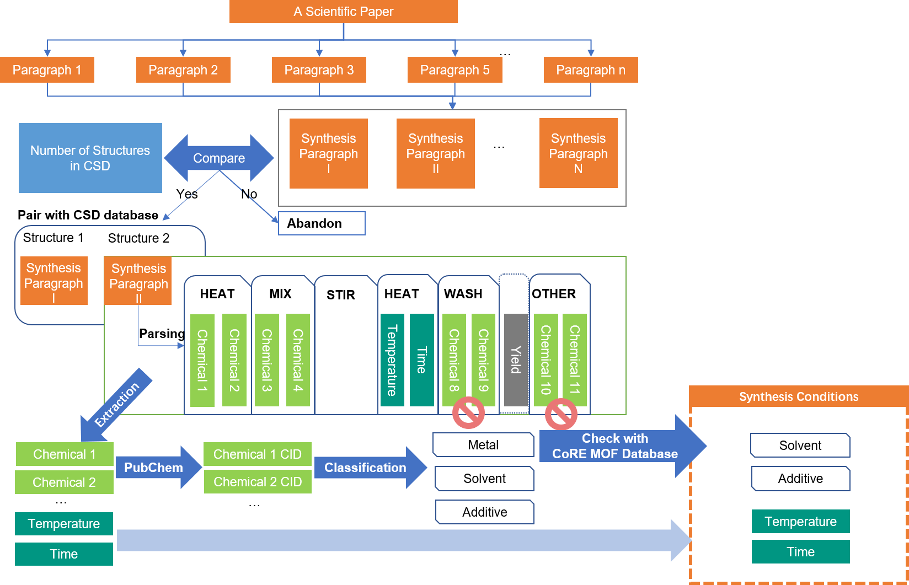

# literature Extraction
## Introduciton of literature Extraction
This part we show the process of how scientific literature is extracted to generate 
a table of the synthesis conditions. 


This part is written in Python.

## Dependency of literature Extraction
* python 3.7
* ...
  
Also needs java in your OS:
* java 6.5


## File descirption
* code: All python script for literature Extraction
```
.
├─cd_lib
│  ├─chetg            # inout and output for chemicaltagger
│  ├─chose_para       # Paragraph classification
│  ├─csd_api          # some functions of CSD API
│  ├─csv_cond         # read the result of chemicaltagger
│  ├─pcplib           # modified pubchempy
│  ├─post_processing  # functions related to the database
├─cd_tools
│  ├─csvalkyrie       # Customized csv operation functions, suitable for cold backup
│  ├─osvalkyrie       # Some system operation functions
│  └─ToHTML           # Database operation functions
├─SampleDatabase      
└─_CommonRedist       # Some necessary files
```
    
* database: the database we extracted for Machine Learning:
  * SynMOF_A:
  * SynMOF_M:  
  * SynMOF_A_for_ML:
  * SynMOF_ME_for_ML:  
  * SynMOF_M_for_ML:


