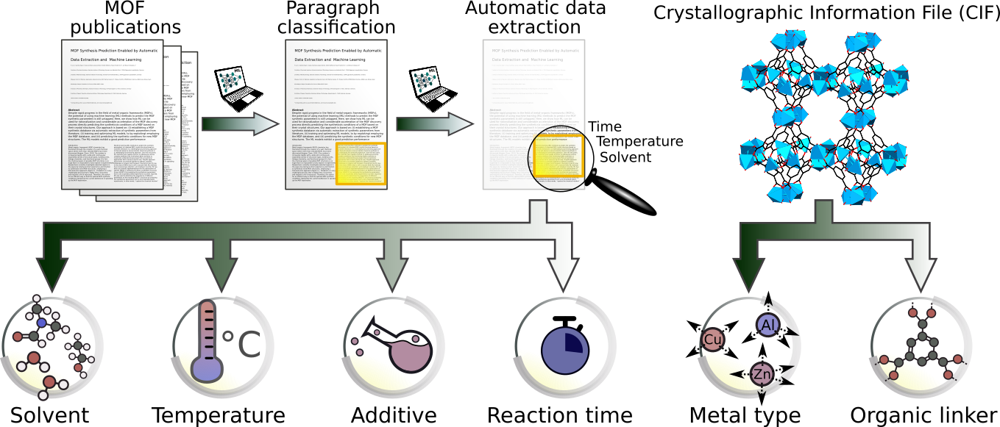

# MOF Literature Extraction

# Paper
**MOF Synthesis Prediction Enabled by Automatic Data Mining and Machine Learning**
Yi Luo, Saientan Bag, Orysia Zaremba, Jacopo Andreo, Stefan Wuttke, Pascal Friederich, and Manuel Tsotsalas
*Basque Center for Materials, Applications & Nanostructures*
*Karlsruhe Institute of Technology*

# Contact
- Data extraction: manuel.tsotsalas@kit.edu

# Requirements
- python 3.x

# Data
- All data required to train the models is contained in this repository.
- The code to train machine learning models for synthesis prediction can be found on
https://github.com/aimat-lab/MOF_Synthesis_Prediction
- Contact for machine learning models: pascal.friederich@kit.edu

